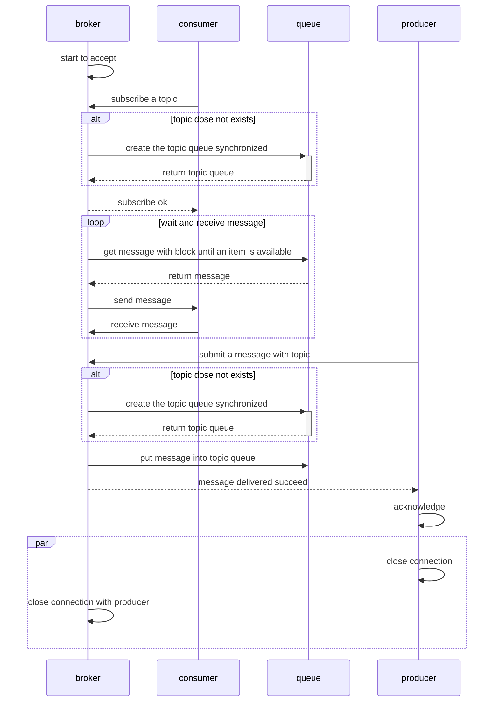

# PMQ
## A Message Queue Broker implemented totally in python

PMQ is a pub-sub message broker. The publish-subscribe pattern, often called the pub-sub pattern involves publishers that produce  messages in different categories and subscribers who consume published messages from various categories they are subscribed to. A message will only be deleted if it's consumed by all subscribers to the category.

## pub/sub sequence diagram
